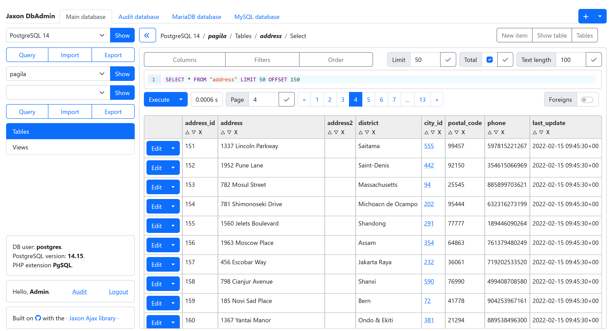

A modern web-based database manager
===================================

## About Jaxon DbAdmin

Jaxon DbAdmin is a modern database manager built on a fully refactored codebase inpired by [Adminer](https://github.com/vrana/adminer) and powered by [Jaxon](https://www.jaxon-php.org).
It brings Adminer into the team era with multi-tab database browsing, query history and bookmarks, all wrapped in a clean, modern interface.

Jaxon DbAdmin is designed with security and accountability in mind.
Users authenticate with their own credentials, database secrets stay strictly server-side and are never shared, and every operation can be recorded in an audit log.

Jaxon DbAdmin is a [Jaxon package](https://www.jaxon-php.org/docs/v5x/extensions/packages.html).
This package is a ready-to-use application running with the Symfony framework.

The database access code (and thus the provided features) originates from [Adminer](https://github.com/vrana/adminer).
The original code was refactored to take advantage of the latest PHP features (namespaces, interfaces, DI, and so on), and separated into multiple Composer packages.
- [https://github.com/lagdo/dbadmin-driver](https://github.com/lagdo/dbadmin-driver): common classes and interfaces for the database drivers.
- [https://github.com/lagdo/dbadmin-driver-pgsql](https://github.com/lagdo/dbadmin-driver-pgsql): the database driver for PostgreSQL.
- [https://github.com/lagdo/dbadmin-driver-mysql](https://github.com/lagdo/dbadmin-driver-mysql): the database driver for MySQL and MariaDB.
- [https://github.com/lagdo/dbadmin-driver-sqlite](https://github.com/lagdo/dbadmin-driver-sqlite): the database driver for SQLite.

The [https://github.com/lagdo/jaxon-dbadmin](https://github.com/lagdo/jaxon-dbadmin) package implements the database management features in a [Jaxon package](https://www.jaxon-php.org/docs/v5x/extensions/packages.html).
Its UI is built with the [https://github.com/lagdo/ui-builder](https://github.com/lagdo/ui-builder) package, which will provide support for multiple frontend frameworks.
[Bootstrap 5](https://github.com/lagdo/ui-builder-bootstrap5) is the default.

## Features and current status

Jaxon DbAdmin currently implements the following features:

- Browse servers and databases in multiple tabs.
- Open the query editor in multiple tabs, with query text retention.
- Save the current tabs in user preferences.
- Save and show the query history.
- Save queries in user favorites.
- Read database credentials with an extensible config reader.
- Read database credentials from a secret manager. Currently supported:
  - [Infisical](https://infisical.com/)
  - [AWS Secrets Manager](https://aws.amazon.com/secrets-manager/)
  - [GCP Secret Manager](https://cloud.google.com/security/products/secret-manager)
  - [OpenBao](https://openbao.org) (compatible with [HashiCorp Vault](https://www.hashicorp.com/fr/products/vault))
  - [Azure Key Vault](https://azure.microsoft.com/fr-fr/products/key-vault)
  - [Alibaba Key Management Service](https://www.alibabacloud.com/help/en/kms)
- Show tables and views details.
- Query a table.
- Query a view.
- Execute queries in the query editor.
- Support Ace and CodeMirror as SQL editors (chosen in config).
- Import or export data.
- Insert, modify or delete data in a table.
- Create or drop a database.
- Create or alter a table or view.
- Drop a table or view.
- Code completion for table and field names in the SQL editor.
- Navigate through related tables.
- Save the executed queries in an audit logs database.
- Show the audit logs in a dedicated page, with restricted access.

The following features are planned for future releases:

- An advanced GUI-based query builder.
- An AI assistant for building and running queries.
- An advanced SQL parser:
  - https://github.com/tobymao/sqlglot
- Alternative UI templates, with WebAwesome, TailwindCSS and Bulma.
- Use an advanced UI component for HTML tables.
- Save and display more data in the audit logs.
- Automated tests.

Documentation and howtos
------------------------

The [documentation](https://github.com/lagdo/jaxon-dbadmin/wiki) is available online.

## License

BSD 3-Clause License - feel free to use, modify, and distribute.
